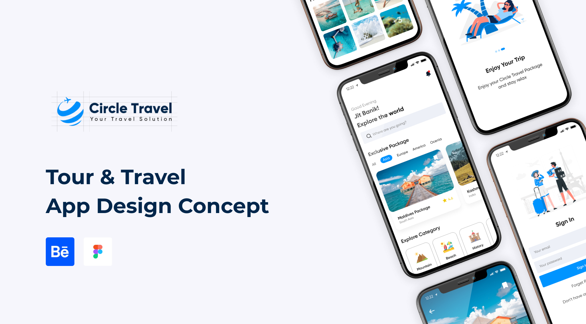

<h1 align="center">
  Circle Travel
</h1>

  Submission Beginner Flutter in Dicoding Course : Trip Travel App.

  
  
  
  
  

  

## Mobile Preview

  

## Website Preview

Preview [Click here](https://pub.dev/packages/sliding_up_panel)

## Features

- Get All Trip Package
- Favorited Trip
- Post About Places in the World

## Package

- [Sliding Up Panel](https://pub.dev/packages/sliding_up_panel)
- [Flutter Map](https://pub.dev/packages/flutter_map)

## Credits

Design by [Jit Banik](<https://www.figma.com/community/file/1045052826187963976/Circle---Tour-and-Travel-App-(Community)>)
